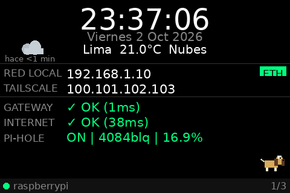
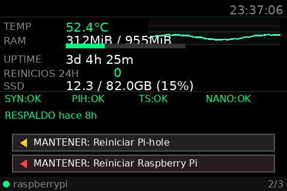
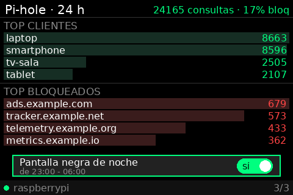

# Pi TFT Dashboard

🇬🇧 [English](README.md) · 🇪🇸 Español

Dashboard para una Raspberry Pi 3B+ con DietPi/Debian, dibujado directamente en el framebuffer de una pantalla TFT de 480x320 (`/dev/fb1`), con touch resistivo.

| Página 1 | Página 2 | Página 3 |
|---|---|---|
|  |  |  |


> **Advertencia:** estos scripts se ejecutan como root y pueden reiniciar servicios y el equipo (reinicio de último recurso, botones de reinicio, watchdog). Úsalo bajo tu responsabilidad: revisa los scripts antes de instalarlos y pruébalo primero en un Pi de pruebas. Se ofrece sin garantía (ver `LICENSE`).

## Características

- Renderizado directo al framebuffer con PIL, sin X11, SDL ni pygame. Solo se escriben las filas que cambiaron y el texto se cachea (~4 % de un núcleo en un Pi 3B+).
- Los datos lentos (red, servicios, clima, Pi-hole) se obtienen en hilos aparte: el touch y las animaciones no se congelan aunque la red esté caída. Un error inesperado no tumba el proceso y systemd lo reinicia si el bucle se cuelga (`WatchdogSec`).
- Tres páginas con rotación automática cada 10 segundos; un toque cambia de página.
- **Página 1:** hora, fecha, clima, IPs (LAN y Tailscale), ping al gateway e internet, estado de Pi-hole y una mascota animada en la esquina a elegir con `DASHBOARD_PET`: `beagle` (por defecto), `shepherd` (pastor alemán), `tabby` (gato atigrado), `white-cat` (gato blanco) o `none`.
- **Página 2:** temperatura (con gráfico), RAM, uptime, reinicios en 24 h, SSD y servicios, una línea con la antigüedad del último respaldo (verde hasta 30 h, rojo si falló o pasa de 50 h) y un aviso rojo "VOLTAJE BAJO" si el Pi detectó subtensión, más botones de mantener pulsado:
  - Reiniciar Pi-hole FTL tras 3 segundos.
  - Reiniciar la Raspberry Pi tras 5 segundos.
- **Página 3:** resumen de Pi-hole de las últimas 24 h, top de clientes, top de dominios bloqueados e interruptor de la pantalla negra nocturna.
- **Pantalla negra de noche** (por defecto 23:00 a 06:00, configurable): pinta la pantalla en negro y deja de dibujar. No la apaga: el backlight de este módulo está cableado a 3.3 V y ningún GPIO lo controla (comprobado con `scripts/backlight-test.sh`). Un toque la despierta 30 s sin cambiar de página. El interruptor de la página 3 lo activa o desactiva y se recuerda tras reiniciar.
- Acciones registradas en `/var/log/dashboard-actions.log`.

## Sistema objetivo

- Raspberry Pi 3B+
- DietPi / Debian
- Framebuffer TFT: `/dev/fb1` (overlay `piscreen`; backlight fijo, sin control por software)
- Entrada táctil: ADS7846 en `/dev/input/event0`
- Pantalla de 480x320, framebuffer RGB565
- Python 3 con `psutil`, `Pillow` y `evdev` (opcional: `numpy`, acelera el dibujado)

## Instalación

```bash
git clone https://github.com/gumorenos/pi-tft-dashboard.git
cd pi-tft-dashboard
sudo ./install.sh --all
sudo nano /etc/dashboard.env      # poner las claves reales
sudo systemctl restart dashboard
journalctl -u dashboard -f
```

`install.sh` acepta:

| Opción | Qué instala |
|---|---|
| (ninguna) | Dependencias, `/root/dashboard.py` y el servicio `dashboard` |
| `--backup` | Respaldo diario de la configuración en `/mnt/ssd/backups` |
| `--bootlog` | Registro de arranques en `/var/lib/dashboard/boots.log` |
| `--watchdog` | Watchdog de hardware vía systemd (ver más abajo) |
| `--alerts` | Avisos push por ntfy (monitor cada minuto) |
| `--journal` | Journal de systemd en disco, para ver los logs de arranques anteriores (ver más abajo) |
| `--all` | Todo lo anterior |

Antes de habilitar el servicio por primera vez, conviene ejecutarlo a mano y comprobar la pantalla:

```bash
sudo bash -c 'set -a; . /etc/dashboard.env; set +a; python3 /root/dashboard.py'
```

## Configuración

Los valores se leen desde `/etc/dashboard.env` (`EnvironmentFile` del servicio), fuera del `.service`. Hay una plantilla en `dashboard.env.example`:

```bash
PIHOLE_PASSWORD=cambiar
OWM_API_KEY=cambiar
OWM_CITY=Lima,PE
#PIHOLE_URL=http://localhost:8089   # la interfaz de Pi-hole; con el puerto estándar: http://localhost
#DASHBOARD_TZ=America/Lima
#DASHBOARD_LANG=es   # idioma de la pantalla: es | en
#DASHBOARD_PET=beagle # mascota: beagle | shepherd | tabby | white-cat | none
#NIGHT_START=23
#NIGHT_END=6
```

El archivo debe ser `chmod 600` y de root. No subas contraseñas ni claves reales al repositorio. Tras editarlo: `sudo systemctl restart dashboard`.

### Mascota

La esquina de la página 1 muestra una mascota animada (mueve la cola o las orejas y parpadea). Se elige con `DASHBOARD_PET` en `/etc/dashboard.env`: `beagle` (por defecto), `shepherd` (pastor alemán), `tabby` (gato atigrado), `white-cat` (gato blanco) o `none`. Un valor desconocido usa el beagle. Hay que reiniciar el servicio tras cambiarlo. De izquierda a derecha:


## Respaldo diario

`scripts/pi-backup.sh` corre cada día a las 03:30 (timer `pi-backup.timer`) y guarda en `/mnt/ssd/backups/AAAAMMDD-HHMMSS/`:

- El teleporter de Pi-hole (ajustes, listas, DHCP).
- `config.tar.gz` con `dashboard.py`, `/etc/dashboard.env`, servicios, `config.txt`, unbound, minidlna, SSH, scripts de `/usr/local/bin` y la identidad de Syncthing.
- Crontab, lista de paquetes e información del sistema.

Si existe `/etc/pi-backup.env` (plantilla `pi-backup.env.example`), `scripts/pi-backup-push.sh` cifra el respaldo con [age](https://age-encryption.org) y lo sube a un repo privado de GitHub con una llave de despliegue. En el Pi solo está la clave **pública**; la privada se guarda fuera (gestor de contraseñas). El repo remoto conserva un único commit con las últimas 14 copias cifradas. El destinatario puede ser una clave de age (`age1...`) o una clave pública SSH ed25519 (`ssh-ed25519 ...`), con la privada protegida por passphrase y guardada fuera del Pi.

Guía completa de descifrado y restauración: [docs/RESTAURAR.md](docs/RESTAURAR.md) (English: [docs/RESTORE.md](docs/RESTORE.md)).

Conserva las últimas 14 copias locales y registra el resultado en `/mnt/ssd/backups/backup.log`. Los respaldos contienen secretos (permisos 700/600). El SSD está en el mismo equipo: para protegerte de un fallo del Pi conviene copiar esa carpeta a otro equipo.

Ejecutar a mano: `sudo /usr/local/bin/pi-backup.sh`. Ver el siguiente: `systemctl list-timers pi-backup.timer`.

## Watchdog seguro

DietPi monta `/var/log` en RAM (tmpfs), así que los logs se pierden al reiniciar y `journalctl` solo ve el arranque actual. Por eso un watchdog mal configurado es difícil de diagnosticar.

Aquí el watchdog de hardware lo maneja **systemd** (`systemd/watchdog.conf`, `RuntimeWatchdogSec=30`). Solo reinicia el Pi si el sistema se cuelga por completo y **no prueba servicios**, así que una falla de Pi-hole u otro servicio nunca provoca un bucle de reinicios. Los servicios caídos los recupera `scripts/pi-resilience.sh` (reinicia el servicio, no el equipo), programado en el cron de root: `*/2 * * * * /usr/local/bin/pi-resilience.sh`.

Evita el demonio `watchdog` de Debian con pruebas de `pidfile`, `ping` o carga: si esa condición falla en el arranque, reinicia una y otra vez.

Para volver atrás: borrar `/etc/systemd/system.conf.d/watchdog.conf`, `systemctl daemon-reexec` y, si se quiere, `systemctl enable --now watchdog`.

## Registro de arranques

`scripts/pi-bootlog.sh` (servicio `pi-bootlog`) añade una línea por arranque a `/var/lib/dashboard/boots.log`: fecha, `wdt=` (distinto de 0 si el último reinicio lo provocó el watchdog) y `throttled=` (subvoltaje o límite térmico). El dashboard usa este archivo para "REINICIOS 24H".

`pi-monitor.sh` añade además `/var/lib/dashboard/health.log`: una línea cada vez que cambia `vcgencmd get_throttled` (con la temperatura), y avisa por ntfy una vez por arranque si hubo subtensión (bits 0/16). La limitación de frecuencia por temperatura (bits 1/17) es normal en una 3B+ a ~60 °C y no avisa.

## Journal persistente

`--journal` guarda el journal de systemd en `/var/lib/journal-disk` y lo monta sobre `/var/log/journal` (línea con `bind,nofail,x-systemd.mkdir` en `/etc/fstab`; si el montaje fallara el Pi arranca igual, con el journal en RAM). Configuración en `/etc/systemd/journald.conf.d/50-persistente.conf`: máximo 40 MB, volcado a la SD cada 5 min (los errores, al instante) para no desgastarla. Se activa en el siguiente reinicio; después, `journalctl --list-boots` muestra los arranques anteriores y `journalctl -b -1 -p warning` los avisos del último. Un corte brusco de luz o un reinicio por hardware pierden los últimos minutos sin volcar.

## Pruebas

La lógica pura del dashboard (ventana nocturna, escalado del táctil, avisos de voltaje, antigüedad del respaldo, conteo de reinicios) tiene pruebas con `unittest`. Necesitan `psutil` y Pillow, pero no `/dev/fb1`:

```bash
python3 -m unittest discover -s tests -v
```

## Alertas con ntfy

[ntfy](https://ntfy.sh) envía notificaciones push al celular por HTTP, sin cuenta ni bots. `--alerts` instala:

- `scripts/pi-notify.sh "Título" "Mensaje" [prioridad] [tags]`: envía un aviso.
- `scripts/pi-monitor.sh` (timer `pi-monitor.timer`, cada minuto): avisa cuando algo falla dos veces seguidas y cuando se recupera. Vigila DNS de Pi-hole, internet, servicios (`pihole-FTL`, `unbound`, `tailscaled`, `syncthing`, `dashboard`), temperatura (75 °C), SD y SSD llenos, SSD sin montar, respaldo atrasado y reinicios del Pi (indica si lo causó el watchdog). Si un aviso no se pudo entregar (por ejemplo sin internet), lo envía cuando vuelve la conexión.

Configuración en `/etc/pi-alert.env` (plantilla `pi-alert.env.example`, permisos 600). El instalador genera un tema aleatorio; **el tema actúa como contraseña**, así que no lo publiques. Instala la app ntfy en el celular y suscríbete a ese tema. Para un servidor propio, cambia `NTFY_URL` (y `NTFY_TOKEN` si tiene autenticación).

Prueba manual: `sudo /usr/local/bin/pi-notify.sh "Prueba" "Hola" default white_check_mark`.

### Reinicio de último recurso

Si Pi-hole no contesta (o no resuelve aunque hay internet) durante 15 minutos seguidos, `pi-monitor.sh` avisa y reinicia el Pi. Nunca reinicia si el problema es el proveedor (sin internet). Protecciones contra bucles: uptime mínimo de 30 min y un solo reinicio de rescate cada 6 h. Tras el arranque, el aviso indica la causa. Se ajusta con `RESCUE_AFTER`, `RESCUE_MIN_UPTIME` y `RESCUE_COOLDOWN`; `RESCUE_DRYRUN=1` solo simula.

### Vigilante externo

Si el Pi se apaga por completo no puede avisar por sí mismo. `scripts/remote-watch.sh` corre en **otro equipo** de la red Tailscale (por ejemplo otro Raspberry Pi tuyo), prueba el puerto 22 del Pi cada minuto y avisa por ntfy tras 3 fallos seguidos y cuando vuelve. Si el equipo vigilante no tiene internet, no dice nada. Instalación: copiar el script a `~/bin/pi-watch.sh`, crear `~/.config/pi-watch.env` (ver la cabecera del script, `chmod 600`) y añadir a cron `* * * * * $HOME/bin/pi-watch.sh >/dev/null 2>&1`.

### Aviso de sesiones SSH

`scripts/pi-ssh-notify.sh` avisa por ntfy cuando entra cualquier usuario desde una IP fuera de la LAN y de Tailscale, o alguno de los usuarios de `SSH_NOTIFY_USERS` (en `/etc/pi-alert.env`, separados por espacios; útil para un agente automático). Se activa con `session optional pam_exec.so quiet /usr/local/bin/pi-ssh-notify.sh` en `/etc/pam.d/sshd`. Con Tailscale en modo userspace las conexiones llegan como `127.0.0.1`, por eso una restricción `from=` en `authorized_keys` no sirve para filtrar por IP de Tailscale.

## Red con respaldo WiFi

Para que Pi-hole siga funcionando si se desconecta el cable:

- Rutas con métricas distintas en `/etc/network/interfaces` (`metric 100` en `eth0`, `metric 600` en `wlan0`). Con la misma métrica y `gateway` en ambas, `ifup` falla ("File exists") y DietPi reintenta cada ~23 s.
- `net.ipv4.conf.all.arp_ignore=1` y `arp_announce=2` (archivo `/etc/sysctl.d/99-dual-nic.conf`) para que cada interfaz responda ARP solo por su IP.
- DNS que reparte el DHCP: `pihole-FTL --config misc.dnsmasq_lines '["dhcp-option=6,IP_ETH,IP_WIFI,1.1.1.1"]'`. El tercer DNS mantiene internet si se cae todo el Pi, a costa de que esos equipos salten el bloqueo mientras tanto.

## Calibración del touch

Las constantes de calibración están al inicio de `dashboard.py`:

```python
TOUCH_RAW_X_MIN = 0
TOUCH_RAW_X_MAX = 4095
TOUCH_RAW_Y_MIN = 0
TOUCH_RAW_Y_MAX = 4095
TOUCH_SWAP_XY   = False
TOUCH_INVERT_X  = False
TOUCH_INVERT_Y  = True
TOUCH_X_OFFSET  = 0
TOUCH_Y_OFFSET  = 16
```

Ajústalas si las zonas de los botones no coinciden con lo que se ve en pantalla.

## Notas de seguridad

Los botones de reinicio de Pi-hole y de la Raspberry Pi requieren mantener el dedo presionado dentro del área del botón. Un toque corto fuera de los botones sigue cambiando de página con normalidad.

Este repositorio excluye a propósito volcados crudos del framebuffer, respaldos locales, logs y archivos `.env`. Solo se versionan las capturas de `docs/`.

## Licencia

GPL-3.0 (GNU General Public License v3), ver `LICENSE`.
