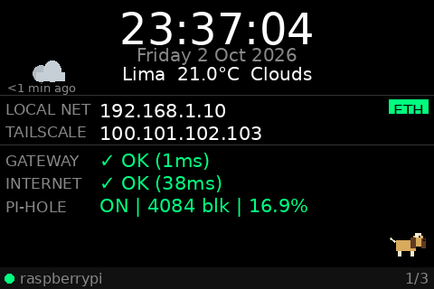
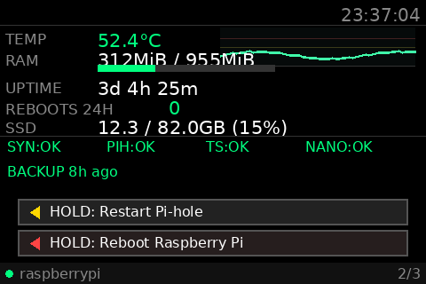
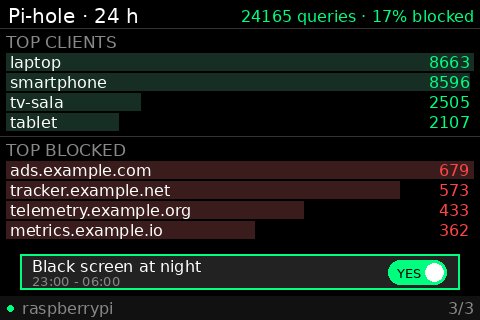

# Pi TFT Dashboard

🇬🇧 English · 🇪🇸 [Español](README.es.md)

A dashboard for a Raspberry Pi 3B+ running DietPi/Debian, drawn straight into the framebuffer of a 480x320 TFT screen (`/dev/fb1`), with resistive touch. It also ships the tooling that keeps a small home server (Pi-hole DNS/DHCP) alive: alerts, watchdog, encrypted backups and an optional AI assistant.

| Page 1 | Page 2 | Page 3 |
|---|---|---|
|  |  |  |

> The screen speaks Spanish or English: set `DASHBOARD_LANG=en` (default `es`). The screenshots above use example data and the English UI; Spanish ones are in `docs/pagina1.png`, `pagina2.png` and `pagina3.png`.

> **Warning:** these scripts run as root and can restart services and reboot the machine (last-resort reboot, reboot buttons, watchdog). Use them at your own risk: read the scripts before installing them and try them on a spare Pi first. Provided without warranty (see `LICENSE`).

## Languages: what is in Spanish and what is bilingual

| Part | Spanish | English |
|---|---|---|
| README, restore guide (`docs/RESTAURAR.md` / `docs/RESTORE.md`) and nanobot README | Yes | Yes |
| nanobot agent templates (`AGENTS` and `USER`, `.md.example` / `.en.md.example`) | Yes | Yes |
| Comments in the `.env.example` files | Yes | Yes |
| TFT screen texts: labels, buttons, dates, warnings and the weather description (`DASHBOARD_LANG=es\|en`, default `es`) | Yes | Yes |
| Screenshots in `docs/` | Yes | Yes |

**Spanish only** (for now):

- Code comments and docstrings.
- The ntfy alerts from `pi-monitor.sh`, `pi-ssh-notify.sh` and `remote-watch.sh`.
- The output of `install.sh`, of the nanobot helpers (`nanobot-telegram-setup`, `nanobot-opencode-setup`, `nanobot-add-models`, `nanobot-secrets-to-env`) and of `backlight-test.sh`.
- The backup log and the README generated inside the backups repo.
- The dashboard's log messages and the systemd unit descriptions.
- The nanobot MCP tools (`nanobot/pi-tools/server.py`): descriptions and responses.
- Test names and comments.

If you need those parts in English, the texts are grouped together and easy to translate; contributions are welcome.

## Features

- Renders directly to the framebuffer with PIL: no X11, SDL or pygame. Only the rows that changed are written and text is cached (~4 % of one core on a Pi 3B+).
- Slow data (network, services, weather, Pi-hole) is fetched in worker threads, so touch and animations never freeze even if the network is down. An unexpected error does not kill the process, and systemd restarts it if the main loop hangs (`WatchdogSec`).
- Three pages that rotate every 10 seconds; a tap changes page.
- **Page 1:** time, date, weather, IPs (LAN and Tailscale), ping to gateway and internet, Pi-hole status and an animated pet in the corner, chosen with `DASHBOARD_PET`: `beagle` (default), `shepherd` (German shepherd), `tabby` (tabby cat), `white-cat` or `none`.
- **Page 2:** temperature (with graph), RAM, uptime, reboots in 24 h, SSD and services, a line with the age of the last backup (green up to 30 h, red if it failed or is older than 50 h) and a red "LOW VOLTAGE" warning if the Pi detected undervoltage, plus press-and-hold buttons:
  - Restart Pi-hole FTL after 3 seconds.
  - Reboot the Raspberry Pi after 5 seconds.
- **Page 3:** Pi-hole summary for the last 24 h, top clients, top blocked domains and the night-blackout switch.
- **Black screen at night** (23:00 to 06:00 by default, configurable): paints the screen black and stops drawing. It does not switch the screen off: the backlight of this module is wired to 3.3 V and no GPIO controls it (verified with `scripts/backlight-test.sh`). A tap wakes it for 30 s without changing page. The switch on page 3 enables or disables it and is remembered across reboots.
- Actions are logged to `/var/log/dashboard-actions.log`.

## Target system

- Raspberry Pi 3B+
- DietPi / Debian
- TFT framebuffer: `/dev/fb1` (`piscreen` overlay; fixed backlight, no software control)
- Touch input: ADS7846 on `/dev/input/event0`
- 480x320 screen, RGB565 framebuffer
- Python 3 with `psutil`, `Pillow` and `evdev` (optional: `numpy`, speeds up drawing)

## Installation

```bash
git clone https://github.com/gumorenos/pi-tft-dashboard.git
cd pi-tft-dashboard
sudo ./install.sh --all
sudo nano /etc/dashboard.env      # put your real keys
sudo systemctl restart dashboard
journalctl -u dashboard -f
```

`install.sh` accepts:

| Option | What it installs |
|---|---|
| (none) | Dependencies, `/root/dashboard.py` and the `dashboard` service |
| `--backup` | Daily configuration backup to `/mnt/ssd/backups` |
| `--bootlog` | Boot log in `/var/lib/dashboard/boots.log` |
| `--watchdog` | Hardware watchdog through systemd (see below) |
| `--alerts` | ntfy push alerts (monitor every minute) |
| `--journal` | Persistent systemd journal, to read logs of previous boots (see below) |
| `--all` | Everything above |

Before enabling the service for the first time, it is worth running it by hand and checking the screen:

```bash
sudo bash -c 'set -a; . /etc/dashboard.env; set +a; python3 /root/dashboard.py'
```

## Configuration

Values are read from `/etc/dashboard.env` (the service's `EnvironmentFile`), outside the `.service` file. A template is in `dashboard.env.example`:

```bash
PIHOLE_PASSWORD=change-me
OWM_API_KEY=change-me
OWM_CITY=Lima,PE
#PIHOLE_URL=http://localhost:8089   # Pi-hole web interface; with the standard port: http://localhost
#DASHBOARD_TZ=America/Lima
#DASHBOARD_LANG=en   # screen language: es | en
#DASHBOARD_PET=beagle # pet: beagle | shepherd | tabby | white-cat | none
#NIGHT_START=23
#NIGHT_END=6
```

The file must be `chmod 600` and owned by root. Never commit real passwords or keys. After editing: `sudo systemctl restart dashboard`.

### Pet

The corner of page 1 shows an animated pet (it wags its tail or ears and blinks). Choose it with `DASHBOARD_PET` in `/etc/dashboard.env`: `beagle` (default), `shepherd` (German shepherd), `tabby` (tabby cat), `white-cat` or `none`. An unknown value falls back to the beagle. Restart the service after changing it. From left to right:


## Daily backup

`scripts/pi-backup.sh` runs every day at 03:30 (`pi-backup.timer`) and stores in `/mnt/ssd/backups/YYYYMMDD-HHMMSS/`:

- The Pi-hole teleporter (settings, lists, DHCP).
- `config.tar.gz` with `dashboard.py`, `/etc/dashboard.env`, services, `config.txt`, unbound, minidlna, SSH, the scripts in `/usr/local/bin` and the Syncthing identity.
- Crontab, package list and system information.

If `/etc/pi-backup.env` exists (template `pi-backup.env.example`), `scripts/pi-backup-push.sh` encrypts the backup with [age](https://age-encryption.org) and pushes it to a private GitHub repo using a deploy key. Only the **public** key lives on the Pi; the private one is kept elsewhere (password manager). The remote repo keeps a single commit holding the last 14 encrypted copies. The recipient can be an age key (`age1...`) or an SSH ed25519 public key (`ssh-ed25519 ...`), with the private key protected by a passphrase and stored off the Pi.

Full decryption and restore guide: [docs/RESTORE.md](docs/RESTORE.md).

The last 14 local copies are kept and the result is logged to `/mnt/ssd/backups/backup.log`. Backups contain secrets (permissions 700/600). The SSD is in the same machine: to protect against a Pi failure, copy that folder to another computer.

Run by hand: `sudo /usr/local/bin/pi-backup.sh`. See the next run: `systemctl list-timers pi-backup.timer`.

## Safe watchdog

DietPi mounts `/var/log` in RAM (tmpfs), so logs are lost on reboot and `journalctl` only sees the current boot. That makes a badly configured watchdog hard to diagnose.

Here the hardware watchdog is handled by **systemd** (`systemd/watchdog.conf`, `RuntimeWatchdogSec=30`). It only reboots the Pi if the whole system hangs and it **does not test services**, so a Pi-hole or other service failure can never cause a reboot loop. Failed services are recovered by `scripts/pi-resilience.sh` (restarts the service, not the machine), scheduled in root's cron: `*/2 * * * * /usr/local/bin/pi-resilience.sh`.

Avoid the Debian `watchdog` daemon with `pidfile`, `ping` or load tests: if that condition fails at boot, it reboots over and over.

To go back: delete `/etc/systemd/system.conf.d/watchdog.conf`, run `systemctl daemon-reexec` and, if wanted, `systemctl enable --now watchdog`.

## Boot log

`scripts/pi-bootlog.sh` (service `pi-bootlog`) appends one line per boot to `/var/lib/dashboard/boots.log`: date, `wdt=` (non-zero if the last reboot was caused by the watchdog) and `throttled=` (undervoltage or thermal limit). The dashboard uses this file for the "REBOOTS 24H" counter.

`pi-monitor.sh` also writes `/var/lib/dashboard/health.log`: one line every time `vcgencmd get_throttled` changes (with the temperature), and sends one ntfy alert per boot if undervoltage was detected (bits 0/16). Frequency capping due to temperature (bits 1/17) is normal on a 3B+ at ~60 °C and does not alert.

## Persistent journal

`--journal` stores the systemd journal in `/var/lib/journal-disk` and bind-mounts it over `/var/log/journal` (a line with `bind,nofail,x-systemd.mkdir` in `/etc/fstab`; if the mount fails the Pi still boots, with the journal in RAM). Configuration in `/etc/systemd/journald.conf.d/50-persistente.conf`: 40 MB maximum, flushed to the SD card every 5 min (errors immediately) to limit wear. It takes effect on the next reboot; afterwards `journalctl --list-boots` shows previous boots and `journalctl -b -1 -p warning` shows the warnings of the last one. A sudden power loss or a hardware reset loses the last minutes that were not flushed.

## Tests

The dashboard's pure logic (night window, touch scaling, voltage warnings, backup age, reboot counting) has `unittest` tests. They need `psutil` and Pillow, but not `/dev/fb1`:

```bash
python3 -m unittest discover -s tests -v
```

## Alerts with ntfy

[ntfy](https://ntfy.sh) sends push notifications to your phone over HTTP, with no account or bots. `--alerts` installs:

- `scripts/pi-notify.sh "Title" "Message" [priority] [tags]`: sends an alert.
- `scripts/pi-monitor.sh` (timer `pi-monitor.timer`, every minute): alerts when something fails twice in a row and when it recovers. It watches Pi-hole DNS, internet, services (`pihole-FTL`, `unbound`, `tailscaled`, `syncthing`, `dashboard`), temperature (75 °C), full SD and SSD, unmounted SSD, overdue backup and Pi reboots (it says whether the watchdog caused it). If an alert could not be delivered (for example no internet), it is sent when the connection returns.

Configuration lives in `/etc/pi-alert.env` (template `pi-alert.env.example`, permissions 600). The installer generates a random topic; **the topic acts as a password**, so do not publish it. Install the ntfy app on your phone and subscribe to that topic. For a self-hosted server, change `NTFY_URL` (and `NTFY_TOKEN` if it requires authentication).

Manual test: `sudo /usr/local/bin/pi-notify.sh "Test" "Hello" default white_check_mark`.

### Last-resort reboot

If Pi-hole does not answer (or does not resolve although there is internet) for 15 minutes in a row, `pi-monitor.sh` alerts and reboots the Pi. It never reboots when the problem is the ISP (no internet). Loop protections: minimum uptime of 30 min and a single rescue reboot every 6 h. After boot, the alert states the cause. Tune with `RESCUE_AFTER`, `RESCUE_MIN_UPTIME` and `RESCUE_COOLDOWN`; `RESCUE_DRYRUN=1` only simulates.

### External watcher

If the Pi powers off completely it cannot alert on its own. `scripts/remote-watch.sh` runs on **another machine** in the Tailscale network (for example another Raspberry Pi of yours), probes the Pi's port 22 every minute and alerts through ntfy after 3 consecutive failures and when it comes back. If the watching machine has no internet it stays silent. Setup: copy the script to `~/bin/pi-watch.sh`, create `~/.config/pi-watch.env` (see the script header, `chmod 600`) and add to cron `* * * * * $HOME/bin/pi-watch.sh >/dev/null 2>&1`.

### SSH session alerts

`scripts/pi-ssh-notify.sh` alerts through ntfy when any user logs in from an IP outside the LAN and Tailscale, or when one of the users in `SSH_NOTIFY_USERS` does (in `/etc/pi-alert.env`, space-separated; useful for an automated agent). Enable it with the line `session optional pam_exec.so quiet /usr/local/bin/pi-ssh-notify.sh` in `/etc/pam.d/sshd`. With Tailscale in userspace mode connections arrive as `127.0.0.1`, so a `from=` restriction in `authorized_keys` cannot filter by Tailscale IP.

## Wi-Fi fallback network

So Pi-hole keeps working if the cable is unplugged:

- Routes with different metrics in `/etc/network/interfaces` (`metric 100` on `eth0`, `metric 600` on `wlan0`). With the same metric and a `gateway` on both, `ifup` fails ("File exists") and DietPi retries every ~23 s.
- `net.ipv4.conf.all.arp_ignore=1` and `arp_announce=2` (file `/etc/sysctl.d/99-dual-nic.conf`) so each interface answers ARP only for its own IP.
- DNS handed out by DHCP: `pihole-FTL --config misc.dnsmasq_lines '["dhcp-option=6,ETH_IP,WIFI_IP,1.1.1.1"]'`. The third DNS keeps internet working if the whole Pi goes down, at the cost of those devices skipping blocking meanwhile.

## Touch calibration

The calibration constants are at the top of `dashboard.py`:

```python
TOUCH_RAW_X_MIN = 0
TOUCH_RAW_X_MAX = 4095
TOUCH_RAW_Y_MIN = 0
TOUCH_RAW_Y_MAX = 4095
TOUCH_SWAP_XY   = False
TOUCH_INVERT_X  = False
TOUCH_INVERT_Y  = True
TOUCH_X_OFFSET  = 0
TOUCH_Y_OFFSET  = 16
```

Adjust them if the button areas do not match what you see on screen.

## Security notes

The Pi-hole restart and Raspberry Pi reboot buttons require holding your finger inside the button area. A short tap outside the buttons still changes page as usual.

This repository deliberately excludes raw framebuffer dumps, local backups, logs and `.env` files. Only the screenshots in `docs/` are versioned.

## License

GPL-3.0 (GNU General Public License v3), see `LICENSE`.
